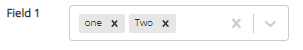

# react-formfields
## Introduction
This component renders a single field in a React project.\
The following types are catered for:-\
- text
- integer
- decimal
- button
- dropdown single
- dropdown multiple
- checkbox
- radio
- date picker

## Settings

### Parameters

#### Fields

<table>
  <thead>
    <tr>
      <th>Parameter</th>
      <th>M/O<sup>[1]</sup></th>
      <th>Used By<sup>[2]</sup></th>
      <th>Comments</th>
    </tr>
  </thead>
  <tbody>
    <tr>
      <td>
      type
      </td>
      <td>
      M
      </td>
      <td>
      All
      </td>
      <td>
        values are:-
        <ul>
          <li>text</li>
          <li>integer</li>
          <li>decimal</li>
          <li>button</li>
          <li>dropdownSingle</li>
          <li>dropdownMulti</li>
          <li>checkbox</li>
          <li>radio</li>
          <li>datepicker</li>
        </ul>
      </td>
    </tr>
    <tr>
      <td>name</td><td>M</td><td>All</td><td>string value</td>
    </tr>
    <tr>
      <td>value</td><td>M</td><td>All</td><td>hook holding value of field</td>
    </tr>
    <tr>
      <td>ref</td><td>O</td><td>All</td><td>Unique identifier of the field</td>
    </tr>
    <tr>
      <td>id</td><td>O</td><td>r</td><td>Used to reference the label to the radio-set.</td>
    </tr>
    <tr>
      <td>fieldClass</td><td>O</td><td>t</td><td>class name</td>
    <tr>  
    <tr>
      <td>placeholder</td><td>O</td><td>t</td><td>place holder text</td>
    </tr>
    <tr>
      <td>hoverMessage</td><td>O</td><td><strong>!</strong>b,<strong>!</strong>dt</td><td>hover message</td>
    </tr>
    <tr>
      <td>label</td><td>O</td><td>r</td><td>radio-set label</td>
    </tr>
    <tr>
      <td>style</td><td>O</td><td>t,r,i,de,b</td><td>eg style={{"marginLeft":'10px'}}</td>
    </tr>
    <tr>
      <td>style</td><td>O</td><td>t,r,i,de,b</td><td>eg style={{"marginLeft":'10px'}}</td>
    </tr>
    <tr>
      <td>icon</td><td>O</td><td>b</td><td>fontawesome icon eg icon="satellite-dish"</td>
    </tr>
    <tr>
      <td>iconColour</td><td>O</td><td>b</td><td>not applicable if icon param doesnt exist or is blank. Otherwise its any colour name or hex number eg iconColour="green". If not set, system defaults to "green"
      </td>
    </tr>
    <tr>
      <td>iconSize</td><td>O</td><td>b</td><td>not applicable if icon param doesnt exist or is blank. Otherwise its bootstrap size value ie xs,sm,md,lg. If not set, system defaults to lg.
      </td>
    </tr>
    <tr>
      <td>iconFasFar</td><td>O</td><td>b</td><td>not applicable if icon param doesnt exist or is blank. This is fontawesome icon structure. Value is either "fas" (solid) or "far" (regular). If not set, system default to "fas".
      </td>
    </tr>
    <tr>
      <td>iconClass</td><td>O</td><td>b</td><td>If button is an icon then this overrides buttonClass. Default is "btn-lg active"
      </td>
    </tr>
    <tr>
      <td>enableField</td><td>O</td><td>All</td><td>value is either true or false. System defaults to true. eg enableField={true} or a hook can be utilsed
      </td>
    </tr>
    <tr>
      <td>radioValue</td><td>M</td><td>r</td><td>See example below</td>
    </tr>
    <tr>
      <td>lookupData <br> lookupDataField</td><td>M</td><td>dds,ddm</td><td>These two types work   together. <br> 
      lookupData is an object holding one or more arrays of data within a key value pairing. <br>
      lookupDataField is the key and used to get the correct data for the dropdown concerned. See example below.
      </td>
    </tr>
    <tr>
      <td>buttonClass</td><td>O</td><td>b</td><td>System defaults to “btn btn-success active”
      </td>
    </tr>
    <tr>
      <td>dateFormat</td><td>O</td><td>dt</td><td>Uses moment.js formatting style. Defaults to dd/MM/yyyy. If date is 1st August 2023 then be 01/08/2023 will be displayed.
      </td>
    </tr>
    <tr>
      <td>minDate</td><td>O</td><td>dt</td><td>Minimum date for the date picker. Format YYYY/MM/DD
      </td>
    </tr>
    <tr>
      <td>nativeDisplay</td><td>O</td><td>All</td><td>Only active if enableField is false.
If nativeDisplay is true and enableField is false, then all fields apart from checkbox and button are displayed in a text field. Checkbox and button are just disabled
      </td>
    </tr>
    <tr>
      <td>nativeStyle</td><td>O</td><td><strong>!</strong>c,<strong>!</strong>b</td><td>Only active if nativeDisplay is true and enableField is false.Default is borderColor:'grey',width:'100%',height:'35px'
      </td>
    </tr>
    <tr>
      <td>displayValue</td><td>O</td><td><strong>!</strong>b</td><td>Only active if enabledField is false. Defaults to “value”.
      </td>
    </tr>
    <tr>
      <td>searchable</td><td>O</td><td>dds</td><td>Defaults to false.<br>
If true, then dropdown allows inline search.
      </td>
    </tr>
    <tr>
      <td>step</td><td>O</td><td>de</td><td>Decimal steps required. System defaults to 0.1.
      </td>
    </tr>
    <tr>
      <td>readOnly</td><td>O</td><td>c</td><td>Sets text field to read only. Values are true or false. Default is false.
      </td>
    </tr>
    <tr>
      <td>checkboxClass</td><td>M</td><td>c</td><td>Class on checkbox, Mandatory as positioning is required which is provided by the class. See example.
      </td>
    </tr>
    <tr>
      <td>checkboxLabelClass</td><td>O</td><td>c</td><td>Class on checkbox label</td>
    </tr>
    <tr>
      <td>checkboxLabelPos</td><td>O</td><td>c</td><td>Position of the label for the checkbox. Values are “left” or “right” (uppercase or lowercase). Default is “right”</td>
    </tr>
  </tbody>
</table>


#### Functions

<table>
  <thead>
    <tr>
      <th>Parameter</th>
      <th>M/O<sup>[1]</sup></th>
      <th>Used By<sup>[2]</sup></th>
      <th>Comments</th>
    </tr>
  </thead>
  <tbody>
    <tr>
      <td>handleEditFormChange</td><td>M</td><td>t,i,de,r,c</td><td>function run when values are being changed</td>
    </tr>
    <tr>
      <td>handleonBlur</td><td>O</td><td>t,i,de</td><td>function run when leaving a field</td>
    </tr>
    <tr>
      <td>handleEditSelectChange</td><td>M</td><td>dds,ddm</td><td>function run when dropdown value changed</td>
    </tr>
    <tr>
      <td>handleButtonClick</td><td>M</td><td>b</td><td>function run when button clicked</td>
    </tr>
    <tr>
      <td>handleDatePick</td><td>M</td><td>dt</td><td>function run when date changed</td>
    </tr>

  </tbody>
</table>


<font size="1">[1] (M)andatory. (O)optional\
[2] t=text; i=integer, de=decimal, dt=datepicker, b=button, c=checkbox, dds=dropdownSingle, ddm=dropdownMulti, r=radio. If ! present then it’s a “not”, so !b means not for button but for all others
</font>

## Examples

### Text Field

#### Minimum Settings

```js
   <FormField
      type="text"
      name="textField1"
      value={textField1Value}
      handleEditFormChange={handleEditFormChange}
      
   />
```

#### Working Code

```js

/* IMPORT SECTION */
import { FormField } from "@csgmaster/react-formfields/";

/* FIELD SECTION */
const [textField1Value, setTextField1Value] = useState('');


/* FUNCTION SECTION */
const handleEditFormChange = (event) => {
        
   event.stopPropagation();
        
   const fieldName = event.target.getAttribute('name');
   let fieldValueS="";
   let fieldValueI=0;
   
   const type = event.target.type;
        
   if (type==="checkbox"){
            
      if (event.target.checked){
         fieldValueI=1;
      }
            
   }
   else{
      fieldValueS=event.target.value;
   }
        
        
   if (fieldName==="textField1"){
      setTextField1Value(fieldValueS);
                
   }
}


/* RENDER SECTION */
return (
         
   <Fragment>
      <Container fluid>
         <Row>
            <label className="col-xs-12 col-sm-1 text-right">Field 1</label> 
            <div className="col-xs-12 col-sm-3 col-md-2">
                                    
               <FormField
                  type="text"
                  name="textField1"
                  value={textField1Value}
                  handleEditFormChange={handleEditFormChange}
                  

               />
            </div>
         </Row>
      </Container>
   </Fragment>
);

```

#### Rendered

Rendered on Screen
 
  


Note:-
- handleEditFormChange is a universal function works for all data types. FormField passes back the event which can be checked for values required.
- enableField is not passed. FormField defaults it to TRUE so that the field is enabled.


### Integer Field

#### Minimum Settings

```js
   <FormField
      type="integer"
      name="intField1"
      value={intField1Value}
      handleEditFormChange={handleEditFormChange}
      
   />

```

#### Working Code

```js
/* IMPORT SECTION */
import { FormField } from "@csgmaster/react-formfields/";

/* FIELD SECTION */
const [intField1Value, setIntField1Value] = useState(0);


/* FUNCTION SECTION */
const handleEditFormChange = (event) => {
        
   event.stopPropagation();
        
   const fieldName = event.target.getAttribute('name');
   let fieldValueS="";
   let fieldValueI=0;
   
   const type = event.target.type;
        
   if (type==="checkbox"){
            
      if (event.target.checked){
         fieldValueI=1;
      }
            
   }
   else{
      fieldValueS=event.target.value;
   }
        
        
   if (fieldName==="intField1"){
      setIntField1Value(parseInt(fieldValueS));
                
   }
}


/* RENDER SECTION */
return (
         
   <Fragment>
      <Container fluid>
         <Row>
            <label className="col-xs-12 col-sm-1 text-right">Field 1</label> 
            <div className="col-xs-12 col-sm-3 col-md-2">
                                    
               <FormField
                  type="integer"
                  name="intField1"
                  value={intField1Value}
                  handleEditFormChange={handleEditFormChange}
                  

               />
            </div>
         </Row>
      </Container>
   </Fragment>
);

```
#### Rendered

Rendered on Screen


    


### Decimal Field

#### Minimum Settings

```js
   <FormField
      type="decimal"
      name="decField1"
      value={decField1Value}
      handleEditFormChange={handleEditFormChange}
      
   />


```

#### Working Code

```js
/* IMPORT SECTION */
import { FormField } from "@csgmaster/react-formfields/";

/* FIELD SECTION */
const [decField1Value, setDecField1Value] = useState(0);


/* FUNCTION SECTION */
const handleEditFormChange = (event) => {
        
   event.stopPropagation();
        
   const fieldName = event.target.getAttribute('name');
   let fieldValueS="";
   let fieldValueI=0;
   
   const type = event.target.type;
        
   if (type==="checkbox"){
            
      if (event.target.checked){
         fieldValueI=1;
      }
            
   }
   else{
      fieldValueS=event.target.value;
   }
        
        
   if (fieldName==="decField1"){
      setDecField1Value(parseFloat(fieldValueS));
                
   }
}


/* RENDER SECTION */
return (
         
   <Fragment>
      <Container fluid>
         <Row>
            <label className="col-xs-12 col-sm-1 text-right">Field 1</label> 
            <div className="col-xs-12 col-sm-3 col-md-2">
                                    
               <FormField
                  type="decimal"
                  name="decField1"
                  value={decField1Value}
                  handleEditFormChange={handleEditFormChange}
                  

               />
            </div>
         </Row>
      </Container>
   </Fragment>
);


```
#### Rendered

Rendered on Screen


Any decimal can be entered but developer needs to check number when using it.
If the field arrows are used then system will use the designated “steps” value. By default FormField uses 0.1. If finer value is required then just pass in parameter "step" into FormField with required value ie 0.01, 0.001 etc.

When default used and arrows are clicked the numbers dhown will be in format 0.1 ie


### Single Value Dropdown Field 

#### Minimum Settings

```js
   <FormField
        type="dropdownSingle"
        name="ddSingleField"
        value={dropdownSingleValue}
        lookupData={singleDDLookupData}
        lookupDataField="Fred"
        handleEditSelectChange={handleEditSelectChange}

      
   />


```

#### Working Code

```js
/* IMPORT SECTION */
import { FormField } from "@csgmaster/react-formfields/";

/* FIELD SECTION */
const [dropdownSingleValue, setDropdownSingleValue] = useState('');

/* this holds the data */
const [singleDDLookupData, setSingleDDLookupData] = useState([]);

/* this is the name of the data key */
const [singleDDLookupField, setSingleDDLookupField] = useState("Fred");


/* HOOK SECTION. This populates the dropdown data*/
useEffect(() => {
        
   /* data can be populated by code run on the server by using Axios or any other
             http client for a browser.
             We have just simplified by creating an array of objects to use 
        */         
   let data=[{ label: "Select", value: "" },
             { label: "one", value: "1" },
             { label: "Two", value: "2" }]

   let dataArray={"Fred": data};
   setSingleDDLookupData(dataArray);
   
        
}, []);


/* FUNCTION SECTION */

const handleEditSelectChange = (selectedOptions,metaData,type) => {
        
   const fieldName = metaData.name;
   let value= selectedOptions.value;
   let desc= selectedOptions.label;
        
   let fieldValue=value.trim();
        
                
   if (fieldName==="ddSingleField"){
      
      setDropdownSingleValue(fieldValue);
            
   }
        
        
}


/* RENDER SECTION */
return (
         
   <Fragment>
      <Container fluid>
         <Row>
            <label className="col-xs-12 col-sm-1 text-right">Field 1</label> 
            <div className="col-xs-12 col-sm-3 col-md-2">
                                    
               <FormField
                  type="dropdownSingle"
                  name="ddSingleField"
                  value={dropdownSingleValue}
                  lookupData={singleDDLookupData}
                  lookupDataField="Fred"
                  handleEditSelectChange={handleEditSelectChange}
               />

            </div>
         </Row>
      </Container>
   </Fragment>
);


```
#### Rendered

Rendered on Screen


### Multi Value Dropdown Field 

#### Minimum Settings

```js
   <FormField
      type="dropdownMulti"
      name="ddMultiField"
      value={dropdownMultiValue}
      lookupData={multiDDLookupData}
      lookupDataField="Fred"
      handleEditSelectChange={handleEditSelectChange}
   />


```

#### Working Code

```js
/* IMPORT SECTION */
import { FormField } from "@csgmaster/react-formfields/";

/* FIELD SECTION */
const [dropdownMultiValue, setDropdownMultiValue] = useState('');

/* this holds the data */
const [multiDDLookupData, setMultiDDLookupData] = useState([]);

/* this is the name of the data key */
const [multiDDLookupField, setMultiDDLookupField] = useState("Fred");


/* HOOK SECTION. This populates the dropdown data*/
useEffect(() => {
        
   /* data can be populated by code run on the server by using Axios or any other
             http client for a browser.
             We have just simplified by creating an array of objects to use 
        */         

   /* NOTE: We do not have a select or default value like dropdownSingle.
            The multi dropdown field will automatically add “Select” when
            no values are selected
       */
	
   let data=[{ label: "one", value: "1" },
             { label: "Two", value: "2" }]

   let dataArray={"Fred": data};
   setMultiDDLookupData(dataArray);
   
        
}, []);


/* FUNCTION SECTION. Utilising the same function as Single to keep things simple */

const handleEditSelectChange = (selectedOptions,metaData,type) => {
        
   const fieldName = metaData.name;
   let value= "";
   let desc= "";
   let comma="";

   /* “multi” is the type set by the dropdown object. Not controlled by us */
   if (type==="multi"){
      selectedOptions.forEach((element, index, array) => {

         value=value+comma+element.value.trim();
         comma=",";

      });
   }
   else{
      value=selectedOptions.value;
      desc=selectedOptions.label;
   }
        
        
   let fieldValue=value.trim();
        
            
   if (fieldName==="ddSingleField"){
                       
            
      setDropdownSingleValue(fieldValue);
            
            
   }
   else if (fieldName==="ddMultiField"){
                       
            
      setDropdownMultiValue(fieldValue);
            
            
   }
        
        
}


 
/* RENDER SECTION */
return (
         
   <Fragment>
      <Container fluid>
         <Row>
            <label className="col-xs-12 col-sm-1 text-right">Field 1</label> 
            <div className="col-xs-12 col-sm-3 col-md-2">
                                    
               <FormField
                  type="dropdownMulti"
                  name="ddMultiField"
                  value={dropdownMultiValue}
                  lookupData={multiDDLookupData}
                  lookupDataField="Fred"
                  handleEditSelectChange={handleEditSelectChange}
               />

            </div>
         </Row>
      </Container>
   </Fragment>
);


```
#### Rendered

Rendered on Screen


When selections made they are added to the dropdown, with a “x” to allow removal.




### Radio Button 

#### Minimum Settings

```js
    {radioArray.radios!==undefined &&
      radioArray.radios.map((filter) => (
          <FormField
                type={filter.type}
                name={filter.name}
                value={filter.value}
                label={filter.label}
                radioValue={radioValue}
                handleEditFormChange={handleEditFormChange}
          />
      ))    
    }


```

FormField also works with objects. With regards to all values in radioArray, FormField can be sent each object in the array via parameter rowLine thus:-  

```js
    {radioArray.radios!==undefined &&
        radioArray.radios.map((filter) => (
            <FormField
                rowLine={filter}
                radioValue={radioValue}
                handleEditFormChange={handleEditFormChange}
            />
        ))    
    }

```


#### Working Code

```js
/* IMPORT SECTION */
import { FormField } from "@csgmaster/react-formfields/";

/* FIELD SECTION */
/* this holds the current value of the radio button */
const [radioValue, setRadioValue] = useState("1");

/* this array holds all the values of the radio button */
const [radioArray, setRadioArray] = useState([]);


/* HOOK SECTION. This populates the dropdown data*/
useEffect(() => {
   const radioSettings = {
                "radios":
                        [
                           { 	"name": "rd",
                              "id":"Active", 
                              "label":"Active", 
                              "value":"1", 
                              "type":"radio", 
                              "checked":"false", 
                              "style":{marginLeft:'10px'}
                                  },
                           {	"name": "rd",
                              "id":"Complete", 
                              "label":"Completed",
                              "value":"2",
                              "type":"radio",
                              "checked":"false",
                              "style":{marginLeft:'5px'}
                                  }, 
                            {	"name": "rd",
                              "id":"All", 
                              "label":"All",
                              "value":"3", 
                              "type":"radio",
                              "checked":"false",
                              "style":{marginLeft:'5px'}
                            },
                       
                                       
                        ]

		
	
        };
        
        setRadioArray(radioSettings); 
        
    }, []);


/* FUNCTION SECTION. Utilising the same function as Single to keep things simple */

const handleEditFormChange = (event) => {
        
   event.stopPropagation();
        
   const fieldName = event.target.getAttribute('name');
   let fieldValueS="";
   let fieldValueI=0;
   
   const type = event.target.type;
        
   if (type==="checkbox"){
            
      if (event.target.checked){
         fieldValueI=1;
      }
            
   }
   else{
      fieldValueS=event.target.value;
   }
        
        
   if (fieldName==="rd"){
      setRadioValue(fieldValueS);
                
   }
}


 
/* RENDER SECTION */
return (
         
   <Fragment>
      <Container fluid>
         <Row>
            <label className="col-xs-12 col-sm-1 text-right">Field 1</label> 
            <div className="col-xs-12 col-sm-3 col-md-2">
                                    
               {radioArray.radios!==undefined &&
                                 radioArray.radios.map((filter) => (
                                    <FormField
                                            rowLine={filter}
                                            radioValue={radioValue}
                                            handleEditFormChange={handleEditFormChange}
                                            
                                            

                                        />
                                        ))
                                
                                
                               }

            </div>
         </Row>
      </Container>
   </Fragment>
);

```

#### Rendered

Rendered on Screen


### Date Field 

#### Minimum Settings

```js
    <FormField
        type="datePicker"
        name="Date1"
        value={pickDate}
        handleDatePick={handleDatePick}

    />
      
```


#### Working Code

```js
/* IMPORT SECTION */
import { FormField } from "@csgmaster/react-formfields/";

/* FIELD SECTION */
/* this holds the current value of the radio button */
const [pickDate, setPickDate] = useState(null);


/* HOOK SECTION. This populates the dropdown data*/
None

/* FUNCTION SECTION. */

const handleDatePick = (name,date) => {
      
        if (name==="Date1"){
          setPickDate(date);
          
        }
};


 
/* RENDER SECTION */
return (
         
   <Fragment>
      <Container fluid>
         <Row>
            <label className="col-xs-12 col-sm-1 text-right">Field 1</label> 
            <div className="col-xs-12 col-sm-3 col-md-2">
                                    
               <FormField
                  type="datePicker"
                  name= "Date1"
                  value={pickDate}
                  handleDatePick={handleDatePick}
                                            
                                            

                                        />
            </div>
         </Row>
      </Container>
   </Fragment>
);


```

#### Rendered

Rendered on Screen


Click Calendar


Pick Date


#### Useful Date Settings

Below the extras added to the minimum date requirements are
- minDate
- dateFormat


```js
<FormField
   type="datePicker"
   name="Date1"
   value={pickDate}
   minDate={pickMinDateDate}  <----
   dateFormat={pickDateFormat}  <----
   handleDatePick={handleDatePick}
/>                                            

```

Below the extras added to the minimum date requirements are hooks for: 
- pickMinDateDate
- pcokDateFormat


```js
/* IMPORT SECTION */
import { FormField } from "@csgmaster/react-formfields/";

/* FIELD SECTION */
/* this holds the current value of the radio button */
const [pickDate, setPickDate] = useState(null);

const [pickMinDateDate, setPickMinDateDate] = useState(new Date("10/05/2023"));  
const [pickDateFormat, setPickDateFormat] = useState("MMMM d, yyyy h:mm aa"); 


/* FUNCTION SECTION. */

const handleDatePick = (name,date) => {
      
        if (name==="Date1"){
          setPickDate(date);
          
        }
};

 
/* RENDER SECTION */
return (
         
   <Fragment>
      <Container fluid>
         <Row>
            <label className="col-xs-12 col-sm-1 text-right">Field 1</label> 
            <div className="col-xs-12 col-sm-3 col-md-2">
                                    
               <FormField
   			type="datePicker"
   			name="Date1"
   			value={pickDate}
   			minDate={pickMinDateDate}
   			dateFormat={pickDateFormat}
   			handleDatePick={handleDatePick}
/>
            </div>
         </Row>
      </Container>
   </Fragment>
);

```

<strong>minDate</strong> uses any format used by <strong>date()</strong> object.<br>
For simplicity usage of mm/dd/yyyy will suffice.
If another datepicker is used to get the date, then any format used by the datepicker will be fine.

The dateFormat uses date-fns formatting. See https://date-fns-interactive.netlify.app/

Following using 10/05/2023 (5th October 2023) as the minimum date.<br>
Display format is MMMM d, yyyy h:mm aa

Rendered on Screen<br>


Click calendar. As can be seen any date before 5th Oct is disabled and cannot be selected. This is the consequence of the minDate parameter


Pick date


As can bee seen the formatting has changed to the onse shown and is directly related to the formated "MMMM d, yyyy h:mm aa" used


### Checkbox 

#### Minimum Settings

```js
    <FormField
        type="checkbox"
        name="tickbox"
        label="Tick Me"
        value={checkboxValue}
        checkboxClass="check-input"
        handleEditFormChange={handleEditFormChange}
    />                                            


```

#### Working Code

```js
/* CSS class */

.check-input{
    vertical-align: middle;
    margin-right: 10px !important;
    width: 30px; 
    height: 30px;
}
```

vertical-align – required to position box and label in the middle. <br>
margin-right/margin-left – this is the space between the label and the check box. <br>
If label is on the right then margin-right is required. 
If label is required on the left then 2 things needed
- Prop checkboxLabelPos is required to be passed in with value “left”
- margin-right in class being used is replaced by margin-left.

Width/height are optional. They control the size of the checkbox.


```js


/* IMPORT SECTION */
import { FormField } from "@csgmaster/react-formfields/";

/* FIELD SECTION */
/* this holds the current value of the radio button */
const [checkboxValue, setCheckboxValue] = useState('');


/* FUNCTION SECTION. */

const handleEditFormChange = (event) => {
        
   event.stopPropagation();
        
   const fieldName = event.target.getAttribute('name');
   let fieldValueS="";
   let fieldValueI=0;
   
   const type = event.target.type;
        
   if (type==="checkbox"){
            
      if (event.target.checked){
         fieldValueI=1;
      }
            
   }
   else{
      fieldValueS=event.target.value;
   }
        
        
   if (fieldName==="tickbox"){
      setCheckboxValue (fieldValueI);
                
   }
}

/* RENDER SECTION */
return (
         
   <Fragment>
      <Container fluid>
         <Row>
            <label className="col-xs-12 col-sm-1 text-right">Field 1</label> 
            <div className="col-xs-12 col-sm-3 col-md-2">
                                    
               <FormField
                        type="checkbox"
                        name="tickbox"
                        label="Tick Me"
                        value={checkboxValue}
                        checkboxClass="check-input"
                        handleEditFormChange={handleEditFormChange}
                />
            </div>
         </Row>
      </Container>
   </Fragment>
);


```

#### Rendered

Rendered on Screen


